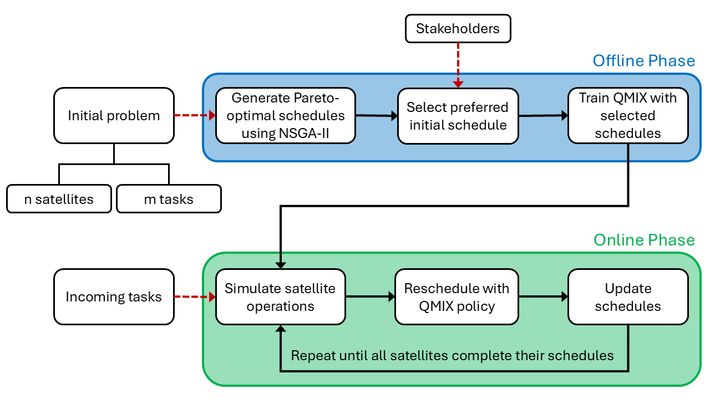

# A Multi-Objective Multi-Agent Reinforcement Learning framework for Earth Observation Satellite Scheduling (EOSS)

This repository contains a modular two-phase framework for solving the **Earth Observation Satellite Scheduling (EOSS)** problem with both **multi-objective** and **dynamic** aspects.  

- **Offline phase**: Uses a multi-objective optimisation algorithm (**NSGA-II**) to generate diverse task assignments. A subset, selected based on stakeholder preferences, is used to train a **Multi-Agent Reinforcement Learning (MARL)** model (**QMIX**).  
- **Online phase**: The trained model is deployed in a simulated dynamic environment with incoming tasks.  

The framework separates optimisation from dynamic task allocation, making it flexible, scalable, and supportive of human-in-the-loop decision-making.

<!-- An overview of the framework is shown in the flowchart below:

  

 -->

## Datasets

The datasets used to validate this framework are stored in the `datasets` folder and include two scenarios: **small-scale** and **large-scale**, each containing three datasets.  

Each dataset has two files:  
- **Initial task set** – used in the offline phase.  
- **Incoming task set** – used in the online phase.  

For example, in `datasets/Small scale/`:
- `n3_m50.txt` – 50 initial tasks with 3 satellites.  
- `n3_m50_inc10.txt` – 10 corresponding incoming tasks.  

The scripts `generate_initial_tasks.py` and `generate_incoming_tasks.py` can be used to generate these files. You can adjust parameters (e.g., number of agents, number of tasks) at the top of each script to customise the datasets.

## Offline Phase (Phase 1)

The offline phase code is located in the `Phase1` folder:

- **NSGA-II**: Implemented in `Phase1/nsga2/`, which includes:
  - The *Problem* class for the EOSS problem (inheriting from `pymoo`’s `Problem` class).
  - The NSGA-II algorithm from the `pymoo` library.

- **Environment & QMIX model**: Also in `Phase1/nsga2/`, containing:
  - The environment setup.
  - The QMIX model architecture.
  - The training process for the offline phase.
  - The rescheduling process (used in the online phase).

- **Main script**: `Phase1/main.py` automatically runs the offline phase **30 times** for a given initial task set.  
  - In each run:
    1. NSGA-II finds non-dominated solutions.  
    2. A random solution is selected as the *preferred schedule* to simulate stakeholder preferences.  
    3. All schedules with the same objectives as the preferred schedule are used to train the QMIX model.  
  - The chosen schedule, its objectives, and the trained QMIX model for each run/dataset are saved in `Phase1/results/`.

**Customisation:**
- **Change dataset**: Modify dataset size in lines **8 – 9** of `Phase1/main.py`.  
- **Manually select preferred schedule**: Comment out lines **38 – 41** and uncomment line **36**.

**Note:** Two scheduling objectives are considered: maximizing the task completion rate and maximizing the total reward of completed tasks, both calculated in `/prj_utils/utils.py`.

## Online Phase (Phase 2)  

The online phase (`Phase2` folder) simulates incoming tasks during satellite execution. Three algorithms are evaluated in this phase:  

- **QMIX** (`Phase2\qmix\`) – calls the rescheduling process of the trained QMIX model.  
- **RNSGA-II** (`Phase2\rnsga2\`) – implemented using the `pymoo` library.  
- **Greedy** (`Phase2\greedy\`) – a simple heuristic-based method.  

**Main script**: `Phase2/main.py` automatically runs the online phase **30 times** for each output generated in Phase 1.  

For each algorithm and each run:  
1. Simulate task arrivals.  
2. Perform rescheduling.  
3. Measure performance (similarity to the initial schedule and computational runtime).  

Results for each dataset are saved in `Phase2/results/`. For example, in `Phase2\results\Small scale\n3_m50\QMIX.txt`, each line represents one run, which contains two values:  
- Average runtime (in seconds)  
- Average similarity score across all rescheduling operations for that dataset.  
